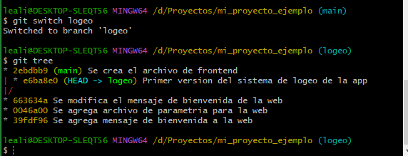
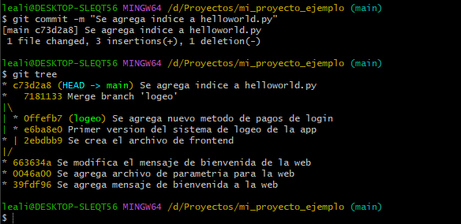

Este tema tiene un índice a parte por la complejidad  del mismo.

1. [Introduccion a Branches](#introduccion-a-branches)
2. [Ramas](#2.-ramas)
    * [Introduccion Ramas](#Introduccion-git-diff)
    * [Hard Reset](#hard-reset)
    * [TAGS](#tags)
    * [Desplazamiento por ramas](#deplazamiento-por-ramas)
    * [Ramas BRANCH y SWITCH](#ramas-branch-y-switch)
3. [Ejemplo Practico](#3.-ejemplo-practico)
4. [Ejemplo con conflictos](#4.-ejemplo-con-conflictos)
5. [Stash](#5.-stash)


## 1. Introduccion a Branches

## 2. RAMAS

### Introduccion GIT DIFF

Aveces puede ocurrir que estamos trabajando en un fichero y no estamos seguros si lo que estamos por agregar al stage es correcto o no. Y antes de hacer el commit queremos ver el cambio con respecto a la versión original. Para esto existe el comando __git diff__

Para poder trabajar con el git diff no debemos tener el último cambio en el stage. (SIN GIT ADD)

* Hacemos un cambio en el fichero helloWorld.py

```bach
git diff
```


Vemos la versión anterior y la nueva en verde. Este cambio aún no ha sido confirmado en el __stage__

__¿Qué pasaria si queremos movernos a otro commit anterior sin antes haber guardado este utimo cambio?

Al hacer un checkout veriamos esto.


DOnde se ve que nos pide que antes commitemos el cambio en el fichero helloWorld.py


**SOLUCION**

1. Hacemos un git checkout al fichero helloWorld.py para dejarlo como estaba antes.

__Elmina el cambio en el mensaje__

2. Ahora queremos volver al commit donde solo teniamos el fichero helloWorld.py

```bash
git checkout c84cb60b702e0afce4d51f9e150ff6b27090d273
```

Ahora el HEAD se mueve al commit incial y elimina el archivo hellogit2 que habiamos creado.


```bash
git checkout HEAD
```

__¿Cómo deshacemos esto?__

desde git tree veo todos los commits.

```bash
 git checkout 2e25d5a
```
Este es el ultimo commit donde tenia todos los archivos, si lo ejecuto vuelvo a tener todo como estaba antes.

### Hard Reset

Nos permite elminar commits y volver a un punto en el tiempo especifico.

Ejemplo.

Hoy estamos áca, tenemos tres commits y la cabecera está al final.


Sabemos que todo lo que hicimos en los dos ultimos commits está mal y solo queremos tener el primero.

```bash
git reset --hard c84cb60
```
Cambia la cabecera


Pero ahroa me doy cuenta que el commit del medio lo necesitaba. __¿Cómo lo recupero?__

```bash
git reflog
git checkout 8b98dae
```

### TAGS

Siginfica etiquetar un commit. Esto se utiliza cuando estamos haciendo referencias a que son puntos importantes. Generalmente son las versiones.

```
Todo lo que subí hasta este punto es la version 1.1
```


Ahora mi punto en el tiempo está en mi __git tag__

* Si agregamos un nuevo fichero y le hacemos commit, el head y el main se mueven pero el tag se ha quedado en el pasado.


Puedo ver todos mis tags.

```bash
git tag
```

Vuelvo a un punto concreto, hago lo que tengo que hacer y luego vuelvo a lo nuevo.

```bash
git checkout clase_1
```

### deplazamiento por ramas

En el ejemplo anterior siempre nos movimos en la rama __main__ 

Ahora recuperamos el archivo hellogit2.py


Ahora la cabeza y el main no apuntan al mismo lugar,
Para solucionar esto volvemos a hacer un get reset al mismo has.


## Ramas BRANCH y SWITCH

```
Una rama es un concepto que necesitamos crear algo que no tiene sentido trabajarlo en la rama main.
Quiero empezar en una funcionalidad que no se cuendo la voy a terminar y cuando la haya terminado veo comola integro en la __main__
```

```bash
git branch login
```

Esto me crea una rama llamada login pero sigo en la rama __main__, lo se porque es done apunta el main.

```bash
git switch login
```

Ahora estamos en otra rama u otro flujo. El HEAD -> login

 

Creamos un nuevo archivo en esta rama. Este archivo solo estará disponible en loging pero no en la master.

Para buscar diferencias entre ramas podemos usar 

```bash
git diff rama
```


## 3. Ejemplo practico

En este ejemplo práctico vamos a recrear un caso donde una rama main con 3 commits se le hace un branch para comenzar a trabajar en un sistema de logeo y de pagos de la app.
Pero mientras que se está trabajando en este nuevo sistema los ING. de la rama main continuan su desarrollo haciendo que la rama __loging__ quede desactualizada, luego se une todo para terminar con una app funcionando.


1. creamos el directorio del proyecto

```bash
mkdir mi_proyecto_ejemplo
```

2. Inicializamos una repositorio

```bash
git init .
```

3. Le cambiamos el nombre a la Master por __main__  y Creamos los tres commits iniciales en la __main__ 
    * helloworld.py
    * hellogit2.py
    * modificamos uno de los dos .py

```bash
git branch -m main
```


Tenemos los tres commits desde los que queremos partir según el modelo.

4. Ahora creamos una __branch__ para empezar a trabajar en el sistema de logeo.

```bash
git branch logeo
```


Como resultado vemos que la __branch__ se creo en el commit al que apunta el **HEAD** y el **main**

Esto quiere decir que estamos posicionados en un punto especifico de tiempo que es, el último commit.

__Entonces tenemos una branch llamada logeo que ahora tiene el mismo contenido que la rama main__

4.1 El equipo de ingenieros que desarrolla la rama __main__ sigue trabajando por su cuenta desarrollando una nueva funcioanlidad que será __frontend.py__ y nosotros al mismo tiempo trabajaremos en nuestra rama en la funcionalidad __logeo.py__ sin ver lo que hace el otro equipo.


En la rama logeo vemos lo mismo que en la rama __main__. 

5. Creamos el fichero __logeo.py__ y lo agregamos al proyecto __solo en la rama logeo__

**IMPORTANTE** En un primer momento el __archivo.py__ se va a ver reflejado en las dos ramas pero una vez que le hagamos commit solo lo veremos en la rama en la que se creo.


Vemos que el commit está en la rama __logeo__.
Si vamos a ver __main__ a VisualCode no vamos a ver este nuevo archivo.


Aunque no se ve, estamos en la rama __main__ y los cambios hechos en __logeo__no se ven.

6. El equipo de __main__ continua trabajando y no sabe nada de los cambios sobre logeo y crea un nuevo archivo __frontend.py__ y lo comitea en la __main__ 


Ahora vemos que el __main__ y __Head__ pasan al nuevo commit y se genera una bifurcacion simular a la de nuestro diagrama donde la branch __logeo__ tiene un file que no está en __main__ y esta última tiene un file que no está en __logeo__

7. Logeo sigue trabajando y crea el file __pagos.py__ ignorando cualquier cambio en __main__

```bash
git switch logeo
```
Al hacer un switch vemos el _main__está en el último commit pero el __head__ está en la branch __logeo__



Creamos el archivo __pagos.py__

Ahora vemos que a la branch __logeo__ se le agrega un nuevo commit que sigue la linea del commit anterior pero que no está en __main__


8. Ahora tenemos un problema.
__main__ tiene unos archivos y __logeo__ tiene otros y algunos son comunes, lo bueno es que estos archivos comunes no han cambiado.

__¿Cómo hacemos un merge para que ambos repos enten en sincronia?__

```bash
git switch main
git merge login
```

Vamos a la rama __main__, el __head__ se posicionada en esta rama y hacemos un __merge__ de la rama logeo para traernos no nuevo.

Con este merge vemos que todo lo que estaba en __logeo__ pasó a __main__  creando el commit final que queda igual que nuestro diagrama.


Pero en logeo solo tendrá los cambios hasta el último commit y nada posterior.


## 4. Ejemplo con conflictos

En este ejemplo vamos a simular un conflicto.
Ahora despues de haber hecho merge de lo que habia en __logeo__ con __main__ hacemos un cambio en __helloworld.py__ del main 



Vemos que en __main__ hay un cambio que no vamos a tener en __logeo__

Ahora desde __logeo__ agregamos un cambio al mismo archivo y tocamos la misma linea de codigo que tocamos en __main__ y hacemos commit


Ahora __logeo__ tiene un commit que solo está en logeo y __main__ un commit que solo está en __main__ pero ambos tocaron el mismo archivo misma linea. Hacemos un merge en __main__

```bash
git merge logeo
```

nos devuelve esto indicando en que lineas hay un conflicto.


El problema con esto es que GIT no sabe cual es la versión correcta. Entonces debemos decidir con cual nos quedamos.

Debemos decidir que version es la correcta.

cuando lo decidimos hacemos git add git commit y listo.


## 5. Stash

Estamos trabajando en nuestra rama __logeo__ pero no sabemos si queremos hacer un commit de lo que estamos haciendo, es un desarrollo a medias.
De repente nos llaman y nos piden que resolvamos algo que está en la rama __main__ pero no podemos movernos entre ramas sin hacer commit porque perdemos los datos.

Un ejemplo


Una vez que terminamos de hacer lo nuestro en la otra rama , volvemos a __logeo__ pero vemos que lo que teniamos en stash desaparece.
Para ver lo que dejamos en stash hacemos 

```bash
git stash list
git stash pop 
```

El comando trae una lista de todo lo que está en stash y luego lo último que hayamos dejado.

Busco mi fichero lo modifico y luego le hago un git add y git commit.

y finalmente desde la rama __main__ 

```bash
git merge logeo
```

__¿Cómo eliminoun stash?__

```bash
git stash drop
```