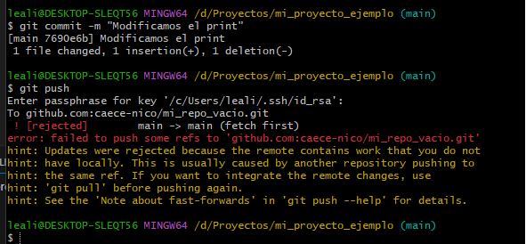

# Introduccion a GITHUB


1. [Introducción]
    * [Diferencia con GIT](#diferencia-con-git)
2. [GITHUB]
    * [Sincronizar cambios](#Sincronizar-cambios)
    * [Seguridad con ssh](#Seguridad-con-ssh)
    * [Subir nuestro primer repo](#subir-nuestro-primer-repo)
    * [Push y Pull](#push-y-pull)


# 1. Introducción

## Diferencia con GIT

GIT es una herramienta de versionado de código que me permite hacer un seguimiento de los cambios. Pero es local a mi equipo, para hacerla distribuida necesitamos de un servidor global que almacene los cambios y permita compartirlos con otros colaboradores. **GITHUB**

```
Con GIT si pierdo mi equipo pierdo todo.
```

# 2. GITHUB

## Sincronizar cambios

a. __¿Cómo puedo empezar a sicronizar los cambios?__

Hay dos posibilidades:

    * Puedo tener un repositorio creado en mi maquina, LOCAL, usando GIT y lo quiero subir a github
    * Puedo queres participar en un proyecto que ya está en GITHUB, me lo debo bajar.

## Seguridad con ssh

1. Desde la consola debemos ver si ya tenemos una clave ssh creadas.

```
En la raiz del disco debemos tener una carpeta oculta llamada .ssh donde deberian estar las claves, si existen.
```

```bash
ssh-keygen -t ed25519 -C "mimail@hotmail.com"
```

__Esto crea una clave publica y una privada__

Paso siguiente nos pide que creemos un nombre para nuestro fichero y luego nos puede pedir una frase que debemos recordar.

```bash
> id_rsa
```

__Comprobar que funciona__

```
eval "$(ssh-agent -s)"
```

__Creamos un fichero de configuración__

```bash

```

__Agregar la clave a nuestro sistemas de gestor de claves en WINDOWS__

```bash

```

Con la clave creada en el ordenador vamos a **GITHUB**, en Settings vamos a seguridad y ponemos __ssh__

* Creamos una nueva clave de tipo ssh Authentication y copiamos el contenido de nuestro archivo generado y lo pegamos en github.

Por ultimo debemos probar que nos podemos conectar a github

```bash
ssh -T git@github.com
```

Esto va a dar un mensaje de error, __no siempre__, pero este mensaje es el bueno.

## Subir nuestro primer repo

Primero debemos crear un repo vacio en __GITBUH__

```html
echo "# mi_repo_vacio" >> README.md
git init
git add README.md
git commit -m "first commit"
git branch -M main
git remote add origin git@github.com:caece-nico/mi_repo_vacio.git
git push -u origin main
```

Cuando creo un nuevo repo me muestra esto.
Vamos a usar el comando , para emparejar nuestro repo local con el de GITHUB.

```
git remote add origin git@github.com:caece-nico/mi_repo_vacio.git
```
* NO pasa nada pero ahora debo hacer un push de mi repo local a GITHUB

```bash
git push -u origin main
```


## Push y Pull

Vamos a subir un cambio a GITHUB pero antes vamos a crear un readme.md en GITHUB y en nuestro repo local vamos a modificar el mensaje del archivo __helloworld.py__

```bash
git add .
git commit -m "Modificamos el mensaje del firchero"
```

Intentamos subirlo, __Esto da error__

```bash
git push
```



El motivo es que los repositorios no están sincronizados porque en GITHUB, que es la fuente de la verdad, hay un archivo __readme.md__ que yo no tengo. Antes de subir debo sincronizar los repositorios.

## Pull

```bash
git fetch
git pull -m #mensaje"
```

__git fetch__ descarga el arbol de cambios pero sin bajar esos cambios
__git pull__ baja los cambios.